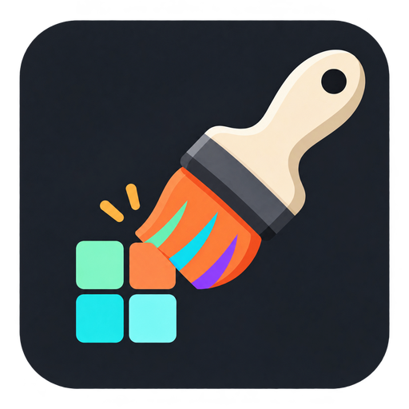
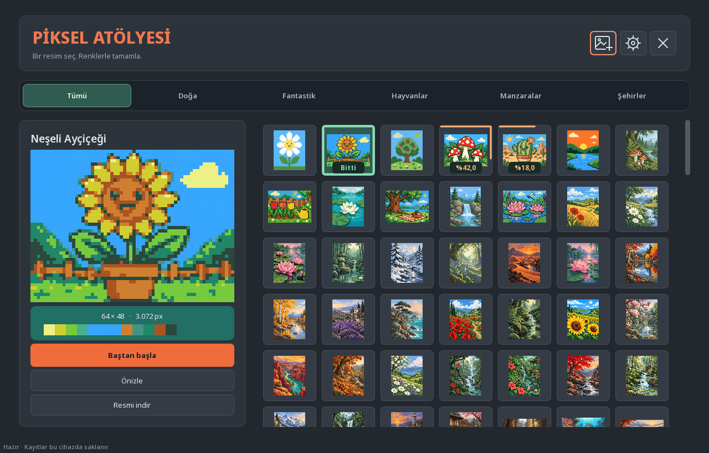
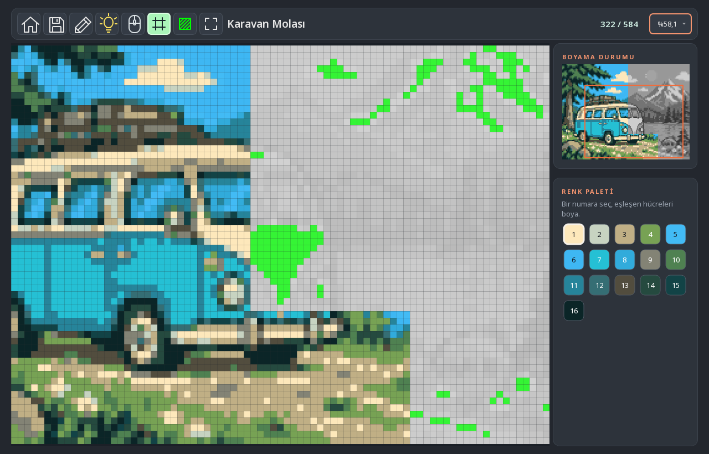
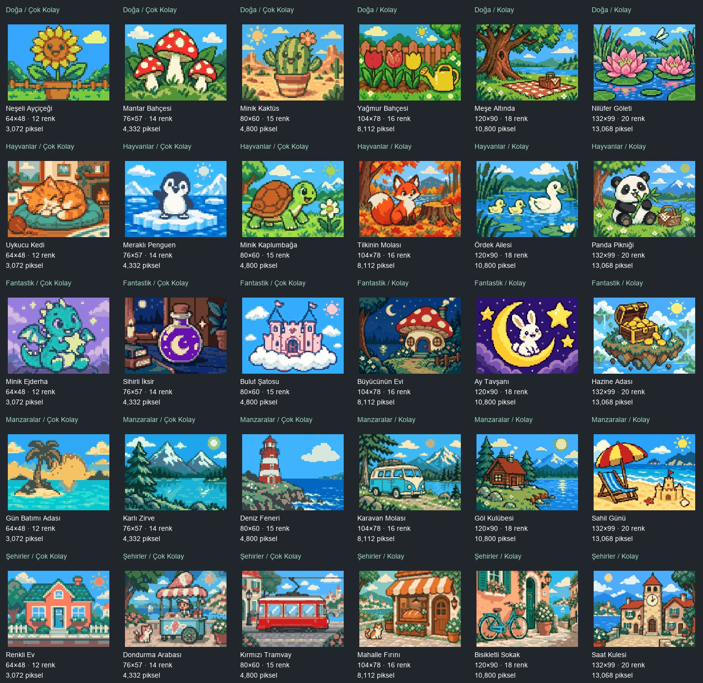
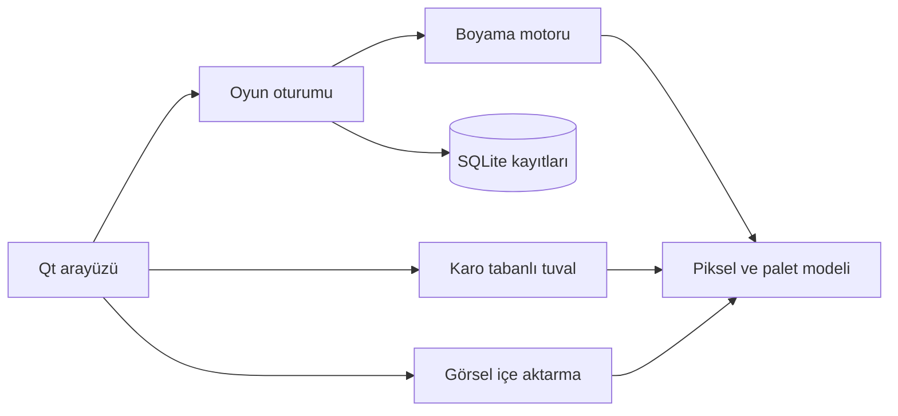

<div align="center">
  

  # Piksel Atölyesi

  **Bir renk seç. Pikselleri boya. Resmi ortaya çıkar.**

  Türkçe, çevrim dışı ve rahatlatıcı bir numaraya göre piksel boyama oyunu.

  [](pyproject.toml)
  [](https://www.python.org/)
  [](https://doc.qt.io/qtforpython-6/)
  [](KOLEKSIYON.md)
  [](LICENSE)

  [Özellikler](#öne-çıkanlar) · [Kurulum](#kurulum) · [Nasıl oynanır?](#nasıl-oynanır) · [Geliştirme](#geliştirme) · [Lisans](#lisans-ve-görsel-hakları)
</div>

---



Piksel Atölyesi, küçük çizgi film sahnelerinden iki milyondan fazla hücre içeren ayrıntılı çalışmalara uzanan bir koleksiyon sunar. İnternet bağlantısı veya kullanıcı hesabı gerekmez: resimler, ayarlar ve ilerleme tamamen kendi bilgisayarında kalır.

## Öne çıkanlar

| | |
|---|---|
| 🎨 **536 hazır resim** | Doğa, Fantastik, Hayvanlar, Manzaralar, Şehirler ve TÜRKİYE koleksiyonları |
| 📈 **Yedi zorluk seviyesi** | Çok Kolay'dan Uzman'a, 2.880 hücreden 2.073.600 hücreye uzanan dengeli ilerleme |
| 🖌️ **İki boyama aracı** | Tek hücre boya veya aynı renkteki bitişik bölgeyi tek dokunuşla doldur |
| 💡 **Akıllı yardım** | Mini harita, kalan hücre vurgusu, renk başına ilerleme ve sağ tıkla renk seçimi |
| 💾 **Otomatik kayıt** | Oyundan çıkıp daha sonra tam olarak kaldığın yerden devam et |
| 🖼️ **Kendi resmini ekle** | PNG, JPEG ve WEBP görsellerini renk paletli oyunlara dönüştür |
| 📤 **PNG dışa aktarma** | Tamamladığın resmi ızgarasız, doğal boyutunda kaydet |
| 🔒 **Tamamen yerel** | Hesap, telemetri, reklam veya sürekli internet bağlantısı yok |

## Boyama deneyimi



Tuval, büyük resimlerde de akıcı çalışması için yalnızca görünen bölümleri çizer. Yakınlaştırabilir, resmi taşıyabilir, mini haritadan başka bir bölgeye atlayabilir ve ampul ipucuyla eksik kalan hücreleri bulabilirsin.

- Doğru olmayan renk hücreyi değiştirmez.
- Sol tuşu basılı tutarak kesintisiz boyayabilirsin.
- Sağ tık, hücrenin istediği rengi doğrudan seçer.
- Palet her renk için boyanan ve toplam hücre sayısını gösterir.
- Tam ekran modu araçları gizleyerek yalnızca resme odaklanmanı sağlar.

## Her tempoya uygun koleksiyon

<p align="center">
  
</p>

Kısa bir mola için küçük ve neşeli bir sahne seçebilir ya da uzun soluklu bir Uzman çalışmasına başlayabilirsin.

| Zorluk | Resim | Genel ölçek |
|---|---:|---|
| Çok Kolay | 30 | Belirgin şekiller, 10–15 renk |
| Kolay | 35 | Küçük sahneler, 15–20 renk |
| Kolay-Orta | 80 | Daha zengin kompozisyonlar |
| Orta | 80 | Orta boyutlu ayrıntılı resimler |
| Orta-Zor | 80 | Daha yoğun alanlar ve geniş paletler |
| Zor | 80 | 70.000–120.000 hücrelik çalışmalar |
| Uzman | 151 | 2.073.600 hücreye ve 60 renge kadar |

Beş ana kategoride 91'er, **TÜRKİYE** koleksiyonunda 81 resim bulunur. Ayrıntılı dağılım için [koleksiyon özetine](KOLEKSIYON.md) bakabilirsin.

## Nasıl oynanır?

1. Koleksiyondan bir kategori ve resim seç.
2. **Baştan başla** veya **Devam et** düğmesine bas.
3. Sağdaki paletten bir renk seç.
4. Numarası seçtiğin renkle eşleşen hücreleri boya.
5. Resim tamamlandığında koleksiyona dönüp **Resmi indir** ile PNG çıktısını al.

<details>
<summary><strong>Fare ve klavye kontrollerini göster</strong></summary>

| Kontrol | İşlev |
|---|---|
| Sol tık / sürükle | Seçili renkle boya |
| Sağ tık | Hücrenin istediği rengi seç |
| Orta tuş + sürükle | Tuvali taşı |
| Fare tekerleği | İmlecin bulunduğu noktaya yakınlaş / uzaklaş |
| Ok tuşları | Tuvalde gezin |
| `Ctrl + S` | İlerlemeyi kaydet |
| `F` | Resmi ekrana sığdır |
| `G` | Izgarayı aç / kapat |
| `M` | Mini haritayı aç / kapat |
| `F11` | Odak görünümünü aç / kapat |
| `Esc` | Odak görünümünden çık veya etkin etkileşimi bitir |

</details>

## Kendi görselini oyuna dönüştür

Ana ekrandaki resim ekleme düğmesiyle kendi görselini seç. Piksel Atölyesi:

1. Görselin EXIF yönünü uygular.
2. Şeffaf alanları beyaz zeminle birleştirir.
3. Seçilen renk sayısına göre paleti sadeleştirir.
4. Her pikseli boyanabilir bir hücreye dönüştürür.
5. Oyun kopyasını ve ilerlemeyi yerel veri klasöründe saklar.

Desteklenen biçimler: **PNG, JPEG, WEBP ve `.pcolor`**. Görseller en fazla 1920 × 1080 olabilir. Kaynak dosyana dokunulmaz.

## Kurulum

### AppImage (önerilen Linux kurulumu)

[GitHub Releases](https://github.com/Teknoloji-Filozoflari/Pixel_Color_Game/releases) sayfasından
`Piksel-Atolyesi-*-x86_64.AppImage` dosyasını indir. Ardından dosyaya çalıştırma izni verip aç:

```bash
chmod +x Piksel-Atolyesi-*.AppImage
./Piksel-Atolyesi-*.AppImage
```

AppImage; Python, PySide6, NumPy ve Pillow bağımlılıklarını içinde taşır. Kurulum veya `sudo`
gerekmez. İndirdiğin dosyayı silmek uygulamayı kaldırmak için yeterlidir; kayıtların ise aşağıda
belirtilen kullanıcı veri klasöründe kalır.

### Pardus / Debian `.deb` paketi

Pardus 25 üzerinde denemek için [GitHub Releases](https://github.com/Teknoloji-Filozoflari/Pixel_Color_Game/releases/tag/v0.15.0)
sayfasından `piksel-atolyesi_0.15.0-1_amd64.deb` dosyasını indirip Pardus Paket Kurucu ile aç.
Terminalden kurmak istersen indirdiğin dosyanın bulunduğu klasörde şunu çalıştır:

```bash
sudo apt install ./piksel-atolyesi_0.15.0-1_amd64.deb
```

Pardus 25 üzerinde paket üretmek için Python 3.13 sanal ortamında projeyi ve PyInstaller'ı
kurduktan sonra `packaging/deb/build-deb.sh` betiğini çalıştır. Çıktı
`dist/piksel-atolyesi_0.15.0-1_amd64.deb` yoluna yazılır. Paket Python ve uygulama
bağımlılıklarını içinde taşır; masaüstü başlatıcısını, simgeyi ve lisans dosyalarını yükler.
Kurulum ve grafik arayüz testi gerçek Pardus masaüstünde yapılmalıdır.

### Teknik gereksinimler

- Python 3.13 veya üzeri
- PySide6 Essentials 6.8–6.x
- NumPy 2.1–2.x
- Pillow 11–12.x
- Linux'ta çalışan bir X11 veya Wayland masaüstü oturumu

Bağımlılık sürüm aralıklarının güncel kaynağı [`pyproject.toml`](pyproject.toml), doğrulamada kullanılan kesin sürümler ise [`requirements-tested.txt`](requirements-tested.txt) dosyasındadır. Kurulum sistem Python paketlerini değiştirmez; bağımlılıklar proje içindeki `.venv` sanal ortamına alınır.

### Linux

Python **3.13 veya üzeri** ve çalışan bir grafik masaüstü oturumu gerekir.

```bash
git clone https://github.com/Teknoloji-Filozoflari/Pixel_Color_Game.git
cd Pixel_Color_Game
sh install.sh
sh start.sh
```

Kurulum betiği proje içinde `.venv` oluşturur ve bağımlılıkları buraya kurar. Ayrıca kullanıcı hesabına bir uygulama menüsü başlatıcısı ve ikon yükler; oyun **Piksel Atölyesi** adıyla aramada ve **Oyunlar** kategorisinde görünür. Yönetici (`sudo`) yetkisi gerekmez. İlk kurulum internet gerektirir; sonraki açılışlarda oyun çevrim dışı çalışır.

Kurulumdan sonra oyunu uygulama menüsünden veya terminalden açabilirsin:

```bash
piksel-atolyesi
```

Oyunu kaldırmak için:

```bash
sh uninstall.sh
```

Bu komut ilerlemeyi korur. Oyunu yerel kayıtlarıyla birlikte tamamen kaldırmak için `sh uninstall.sh --purge-data` kullan.

Elle kurmak istersen:

```bash
python3 -m venv .venv
source .venv/bin/activate
python -m pip install -e .
python run.py
```

### Windows

```powershell
py -3.13 -m venv .venv
.venv\Scripts\python -m pip install -e .
.venv\Scripts\python run.py
```

### Kaynak klasörden hızlı başlatma

Bağımlılıklar zaten kuruluysa:

```bash
python run.py
```

### Komut satırı seçenekleri

```text
python run.py [--data-dir DİZİN] [--debug] [--smoke-test]
```

| Seçenek | Açıklama |
|---|---|
| `--data-dir DİZİN` | Kayıt ve içe aktarılan resimler için özel klasör kullanır |
| `--debug` | Ayrıntılı çizim ve önbellek günlüklerini açar |
| `--smoke-test` | Uygulamayı kısa bir başlangıç kontrolünden sonra kapatır |

### Kurulum sorunları

- `Python 3.13+ is required` mesajında `PYTHON=python3.13 sh install.sh` ile doğru yorumlayıcıyı seç.
- Qt platform eklentisi hatasında dağıtımının Qt/X11 veya Wayland sistem kütüphanelerini kur.
- Sanal ortam bozulduysa `.venv` klasörünü kaldırıp `sh install.sh` komutunu yeniden çalıştır.
- Tanı bilgileri için oyunu `python run.py --debug` ile başlat ve yerel veri klasöründeki `game.log` dosyasını incele.

## Kayıtlar ve gizlilik

Piksel Atölyesi sunucuya bağlanmaz ve kullanıcı hesabı oluşturmaz. İlerleme, ayarlar, içe aktarılan resimler ve günlük dosyası yalnızca yerel uygulama veri klasöründe tutulur.

| Sistem | Varsayılan veri konumu |
|---|---|
| Linux | `~/.local/share/PixelColoring/PikselAtolyesi` |
| Windows | `%LOCALAPPDATA%/PixelColoring/PikselAtolyesi` |

Özel bir veri klasörü kullanmak için:

```bash
python run.py --data-dir ./local-data
```

Bu klasörü oyun kapalıyken kopyalamak, ilerlemenin yedeğini almak için yeterlidir.

## Teknik yapı

Piksel Atölyesi; **PySide6 / Qt Widgets**, **NumPy**, **Pillow** ve **SQLite** üzerine kuruludur. Oyun kuralları arayüzden ayrılmıştır; büyük resimler 256 × 256 hücrelik görünür karolar ve sınırlı bir LRU önbelleğiyle çizilir.



Daha ayrıntılı bilgi için [mimari ve veri akışları belgesini](docs/ARCHITECTURE.md) incele.

## Geliştirme

Geliştirme araçlarıyla kurulum:

```bash
python -m pip install -e '.[dev]'
```

Kontroller:

```bash
python -m pytest -q
python -m ruff check src tests run.py
QT_QPA_PLATFORM=offscreen python run.py --smoke-test --data-dir /tmp/piksel-atolyesi-smoke
```

AppImage üretmek için PyInstaller ve `appimagetool` kurulduktan sonra:

```bash
APPIMAGETOOL=/path/to/appimagetool packaging/appimage/build-appimage.sh
```

`v0.15.0` biçiminde bir Git etiketi gönderildiğinde GitHub Actions, x86_64 AppImage'i ve SHA-256
özetini otomatik olarak GitHub Releases'a ekler. İş akışı Actions sayfasından elle de çalıştırılabilir;
elle çalıştırılan derleme bir workflow artifact'i olarak indirilir.

Proje, 536 gömülü `.pcolor` dosyasının katalog ve metadata bütünlüğünü doğrulayan testler içerir. Katkıda bulunmadan önce [katkı rehberini](CONTRIBUTING.md) okuyabilirsin.

<details>
<summary><strong>Proje yapısını göster</strong></summary>

```text
.
├── docs/                         # Mimari, GitHub rehberi ve ekran görüntüleri
├── LICENSES/                     # Üçüncü taraf lisans metinleri
├── packaging/linux/              # Linux uygulama menüsü girdisi
├── src/pixel_coloring/
│   ├── core/                     # Oyun modeli ve boyama kuralları
│   ├── importer/                 # Görsel ve .pcolor içe aktarma
│   ├── persistence/              # SQLite ve otomatik kayıt
│   ├── rendering/                # Tuval, kamera ve karo önbelleği
│   ├── services/                 # Koleksiyon kurulumu ve güncelleme
│   ├── ui/                       # Qt ekranları ve bileşenleri
│   └── resources/                # Resimler, font, ikon ve çeviriler
├── tests/                        # Çekirdek ve koleksiyon testleri
├── install.sh                    # Linux ilk kurulum betiği
├── start.sh                      # Linux başlatıcısı
├── uninstall.sh                  # Linux kaldırma betiği
├── run.py                        # Kaynak kod başlatıcısı
└── pyproject.toml                # Paket ve bağımlılık tanımı
```

</details>

## Lisans ve görsel hakları

Kaynak kod [MIT Lisansı](LICENSE) altında sunulur.

- Koleksiyon, logo ve ekran görüntülerinin kapsamı: [ASSETS_LICENSE.md](ASSETS_LICENSE.md)
- Bağımlılıklar ve atıflar: [THIRD_PARTY.md](THIRD_PARTY.md)
- Üçüncü taraf lisans metinleri: [LICENSES](LICENSES/README.md)
- Yapay zekâ destekli görseller için yayın notu: [TELIF-VE-YAYIN-NOTU.md](TELIF-VE-YAYIN-NOTU.md)

---

<div align="center">
  
  <br>
  <strong>Bir sonraki resim, seçtiğin ilk renkle başlar.</strong>
</div>
