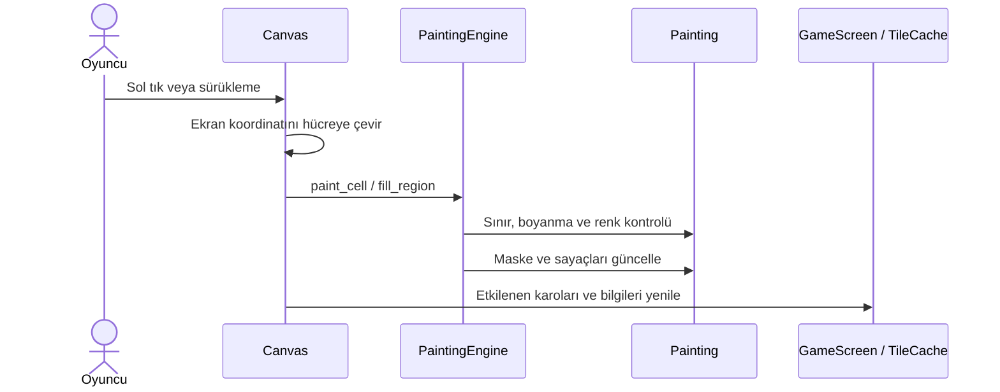

# Mimari ve veri akışları

[README'ye dön](../README.md)

Bu belge v0.14.0 kaynak kodunu anlatır. Uygulama, Qt Widgets arayüzü ile Qt'den bağımsız oyun çekirdeğini ayırır. Sunucu, kullanıcı hesabı veya çevrim içi oyun servisi yoktur.

## Katmanlar ve sorumluluklar

| Modül | Sorumluluk | Başlıca dosyalar |
|---|---|---|
| Başlangıç | CLI seçenekleri, QApplication, veri dizini, günlükleme | `app.py` |
| Çekirdek | Doğru renk kontrolü, boyama maskesi, sayaçlar, oturum | `core/painting.py`, `paint_engine.py`, `game_session.py` |
| Çizim | Kamera dönüşümleri, görünür karolar, imleç, önizleme | `rendering/canvas.py`, `camera.py`, `tile_cache.py`, `progress_preview.py` |
| Arayüz | Ekran geçişleri, araçlar, koleksiyon, palet, ayarlar | `ui/main_window.py`, `game.py`, `collection_browser.py`, `widgets.py` |
| İçe aktarma | Pillow dönüşümü, seviye okuma/yazma | `importer/image_importer.py`, `level_writer.py` |
| Kalıcılık | SQLite, maske paketleme, sıralı kayıt | `persistence/database.py`, `save_manager.py` |
| Koleksiyon | Hazır seviyelerin kurulumu, sürüm dönüşümleri | `services/samples.py`, `library.py`, `bundle_update.py` |

## Başlangıç

`run.py`, `pixel_coloring.app.main()` giriş noktasını çağırır. Başlangıçta veri dizini ve `paintings/` oluşturulur, SQLite açılır, hazır seviyeler kurulur ve `MainWindow` gösterilir. `--data-dir` varsayılan Qt veri yolunu değiştirir; `--smoke-test` kısa bir açılış/kapanış kontrolü, `--debug` tanı görünümü sağlar.

## Resmin bellek modeli

`Painting` tek resmin verisini ve ilerlemesini tutar:

| Alan | Biçim | Amaç |
|---|---|---|
| `palette` | `N × 3`, `uint8` | RGB renk tablosu |
| `target_map` | `H × W`, `uint8` veya `uint16` | Hücrelerin sıfır tabanlı palet indeksleri |
| `painted_mask` | `H × W`, `bool` | Boyanan hücreler |
| `totals` | Renk başına sayaç | Her renge ait toplam hücre |
| `counts` | Renk başına sayaç | Her renge ait boyanan hücre |

Hedef ve palet kopyalanıp salt okunur yapılır; maske ve sayaçlar boyama sırasında değişir. 255'e kadar renk için hedef harita `uint8`, daha büyük paletlerde `uint16` kullanır. Kurucu boyut, RGB aralığı ve renk indekslerini doğrular.

`GameSession`, seçili renk ve değişiklik/kayıt revizyonlarını yönetir. Çekirdekte komut geçmişi desteği bulunsa da oyun oturumu `record_history=False` kullanır; arayüzde geri al/ileri al yoktur. Süre özelliği sıfır döner.

## Boyama akışı



Tekli boyama yanlış renk, sınır dışı hücre ve önceden boyanmış hücreleri ayırır. Toplu boyama satır aralıkları üzerinden ilerleyen bir doldurma algoritmasıdır: yalnızca aynı renkli, dört yönden bağlı, boyanmamış hücreleri kapsar. Çapraz komşuluk bağlantı sayılmaz. Tuval, sürükleme noktaları arasındaki hücreleri de işler.

## Kamera ve çizim

Her hücre için ayrı Qt nesnesi oluşturulmaz. Tek `Canvas`, `Camera` ile görünür hücre aralığını hesaplar ve `TileCache` üzerinden `QImage` karolarını çizer. Karolar 256 × 256 hücredir; önbellek varsayılan 64 MiB sınırla LRU düzeninde tutulur. Boyanan hücreler ilgili karoları geçersiz kılar; renk/vurgu değişiklikleri önbelleği yeniler.

Yakınlaştırmada kamera resim sınırlarına kısıtlanır. Hücre ölçeğinde görünür alan tam hücrelere oturtulur; taşıma sırasında yarım hücre kesilmeleri önlenir. Mini harita boyanan alanları renkli, kalan alanları gri gösterir; bakış çerçevesi görünür alanı temsil eder. İpucu etkin olduğunda kalan hücreler kırmızı vurgulanır.

## İçe aktarma ve dışa aktarma

Raster akışı: EXIF yönüne göre boyut kontrolü → yönü uygulama → şeffaflığı beyaza birleştirme → Pillow renk azaltma → kullanılan renkleri indeksleme → `Painting` → `.pcolor`.

Arayüzden yüklemede genişlik en fazla 1920, yükseklik en fazla 1080'dir. `.pcolor` için de arayüz yükleme sınırı uygulanır. Düşük seviyeli `read_level()` işlevi farklı amaçla kullanıldığında bu arayüz sınırıyla aynı kontrolü yaptığı varsayılmamalıdır; kendi dosya doğrulamalarını uygular.

Tamamlanan resim dışa aktarılırken kayıtlar tamamlanır, ilerleme kontrol edilir ve `palette[target_map]` RGB görüntüsü `QSaveFile` üzerinden PNG olarak yazılır. Çıktıda numara, ızgara ve araç çubuğu yoktur.

## `.pcolor` dosyası

Bir ZIP arşividir:

```text
resim.pcolor
├── metadata.json   # version, id, title, category, author, width, height
├── palette.json    # RGB üçlüleri
├── target.npy      # H × W renk indeksleri
└── preview.webp    # Koleksiyon küçük resmi
```

Dosya biçimi sürümü `1`'dir. Okuyucu arşiv üyeleri için açılmış boyut limitleri uygular, NumPy verisini `allow_pickle=False` ile yükler, metadata boyutlarını resimle karşılaştırır. Yazıcı geçici dosyayı `os.replace` ile hedefe taşır. `.pcolor` boyama ilerlemesini içermez; bu veri SQLite'tadır.

`resources/paintings/catalog.json` kategori, zorluk, sıra, boyut ve renk sayısı bilgilerini taşır. Kimlikler kayıt eşleştirmesinin temelidir; mevcut bir görseli değiştirirken kimliği rastgele değiştirmek ilerlemeyi başka bir seviyeden ayırır.

## Kayıt ve güncelleme

`SaveManager`, arayüz iş parçacığında maskeyi `numpy.packbits` ile paketleyip bir anlık görüntü oluşturur. Tek işçili `ThreadPoolExecutor`, SQLite yazımlarını sırayla gerçekleştirir. `flush()` bekleyen işlemleri tamamlar ve hataları iletir; başarısız kayıt sessizce başarılı sayılmaz.

SQLite'ta resim metadata'sı, ilerleme ve ayarlar bulunur. WAL modu kullanılır. Süre ve toplu istatistik verileri güncel sürümde tutulmaz; eski `statistics` ve `achievements` tabloları uyumluluk için kalır fakat temizlenir.

Hazır seviye güncellemelerinde `bundle_update.py` mevcut dosyayı ve kaydı değerlendirir. Gerekli boyut dönüşümlerinde maske yeni ızgaraya aktarılır; önceki resim/kayıt `paintings/backups/` altında yedeklenir. Sadece yeni seviye eklenen v0.14.0 değişikliğinde eski 180 dosya değişmedi.

## Genişletme noktaları

- Yeni araç: `ui/game.py` ve `rendering/canvas.py`; oyun kuralları gerekiyorsa `core/paint_engine.py`.
- Yeni seviye: doğrulanmış `.pcolor` ve katalog girdisi; piksel/renk sınırlarını kategori testleriyle kontrol et.
- Yeni kalıcılık alanı: SQLite şemasını ve eski kayıt dönüşümünü birlikte ele al.
- Yeni giriş biçimi: `importer/` altında dönüştür; Qt widget işlemlerini ana iş parçacığında tut.

Bu tasarımın performans hedefleri donanıma bağlıdır; belirli FPS veya bütün platformlarda eşit davranış garantisi verilmez.
